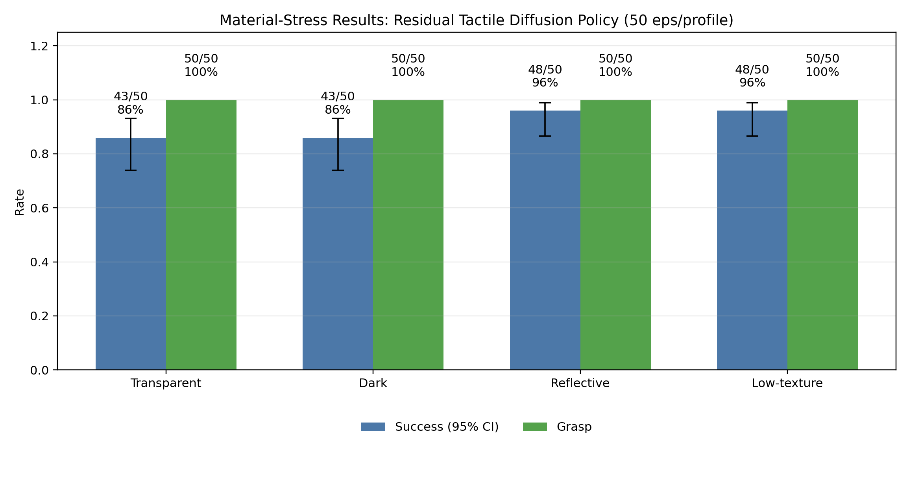
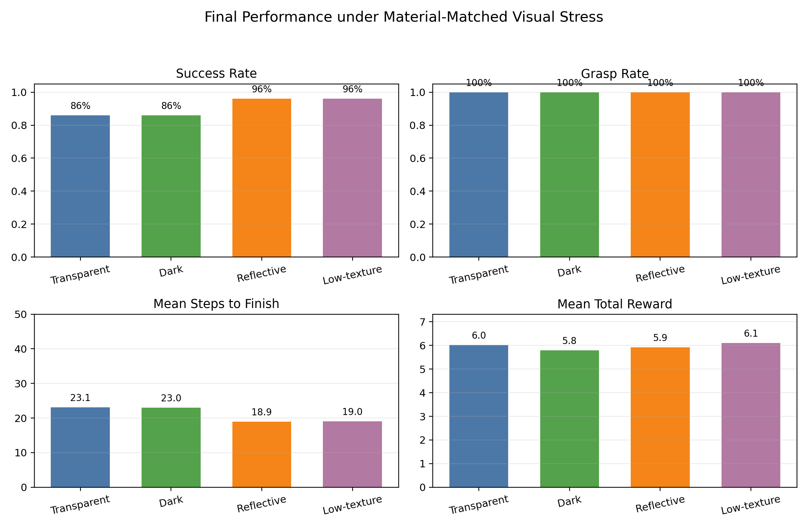
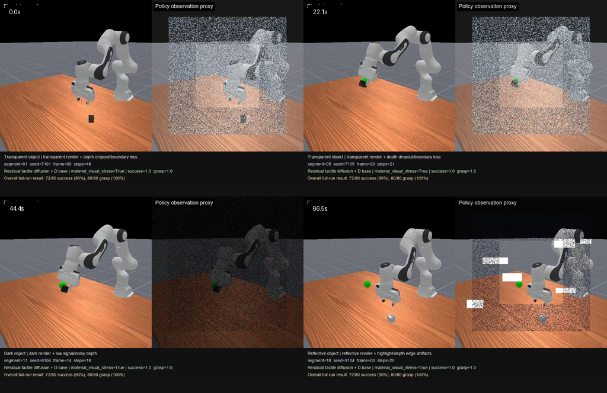

# Material-Stress 抓取实验故事

这份文档用于和老师交流项目进展：为什么早期“透明、深色、高反射、低纹理物体”结果看起来不够可信，我们后来怎样重新设计实验，以及最终更严谨的结果说明了什么。

## 实验动机

早期 material-object 实验只改变了仿真中 cube 的渲染材质，但策略真正接收到的观测流没有被材质特性同步扰动。因此，在相同 seed 范围下，不同材质 profile 会出现几乎一样的结果。这会让图表看起来像“换了名字但数据没变”，很难支撑“透明/深色/反光/低纹理抓取鲁棒性”的实验叙述。

为了解决这个问题，最终实验做了三件事：

1. 在仿真中使用材料级物体外观 profile：transparent、dark、reflective、low-texture。
2. 对 RGB-D 输入施加与材质匹配的视觉压力，让策略观测也随材质变化而变难。
3. 重新采集 teacher demonstrations，并在 material-stress 数据分布上重训 D-assisted residual tactile diffusion policy。

## 方法流程

完整流水线由 `scripts/run_material_stress_retrain_pipeline.ps1` 实现。

项目从 MVP 到当前实验设计的决策路径见 [MVP 决策流程图](../mvp_decision_flow.md)。

最终训练与评估流程如下：

1. 采集 500 条 D-assist teacher demonstrations，每类材质 125 条。
2. 用 material-stress demonstrations 训练 D policy。
3. 在 D policy 基础上训练 tactile-conditioned residual diffusion policy。
4. 最终评估每类材质 50 个 episodes，共 200 次 rollout。
5. 汇总 success、grasp、mean steps、mean reward，并报告 Wilson 95% 置信区间。

材质匹配视觉压力由 `scripts/material_stress.py` 实现，结果汇总与画图由 `scripts/summarize_material_stress_results.py` 生成。

## 最终结果

最终评估每类材质使用 50 个 episodes。

| Material profile | Success | Success rate | Wilson 95% CI | Grasp |
| --- | ---: | ---: | ---: | ---: |
| Transparent | 43/50 | 86% | 74%-93% | 50/50 |
| Dark | 43/50 | 86% | 74%-93% | 50/50 |
| Reflective | 48/50 | 96% | 87%-99% | 50/50 |
| Low-texture | 48/50 | 96% | 87%-99% | 50/50 |

总体结果为 182/200 success，即 91%；200/200 grasp，即 100%。

## Demo 预览

本地还生成了一个较长的 side-by-side 展示视频：左侧为 simulator render，右侧为 material-matched visual stress 下的 policy observation proxy。

MP4 视频默认不提交到 Git，因为实验视频通常较大，并且仓库当前会忽略 `*.mp4`。本地路径为：

`results/material_stress_demo_long/material_stress_long_demo_side_by_side.mp4`

预览图如下：

## 结论解读

这组结果比早期 render-only material 实验更可信，因为策略输入本身也会随着物体材质变化而变难。同时，它也比最初每类 20 次的版本更严谨：最终总共评估 200 次 rollout，并给出了 95% 置信区间。

需要注意的是，这仍然应被表述为 simulation stress test，而不是直接的真实世界透明物体/深度相机验证。Transparent 和 dark profile 的 success rate 低于 reflective 和 low-texture，这一点反而是可信的讨论点：透明和暗色物体确实是更难的视觉条件。

## 文件说明

- `assets/material_stress_success_grasp_chart.png`: 带 Wilson 95% CI 的 success/grasp 图。
- `assets/material_stress_performance_chart.png`: success、grasp、steps、reward 综合图。
- `assets/material_stress_plot_summary.csv`: 画图使用的数值结果。
- `assets/material_stress_summary.md`: 自动生成的结果 summary。
- `assets/material_stress_long_demo_preview.png`: 长 demo 视频的预览拼图。
