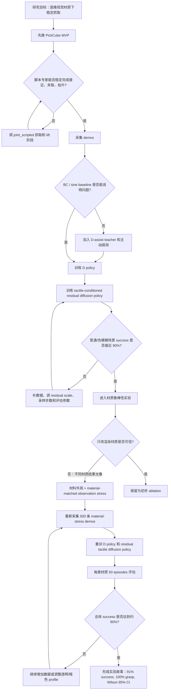
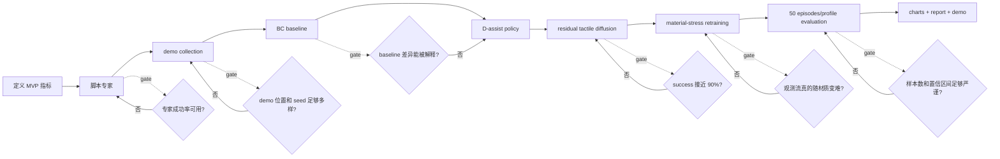

# MVP 决策流程图

这份图用于解释项目从最小可行原型到当前 material-stress 实验的决策路径。核心逻辑不是“一开始就做复杂模型”，而是每一步都用实验结果决定是否升级方案。

## 老师汇报版

## 工程执行版

## 关键决策点

| 阶段 | 判断问题 | 通过标准 | 不通过时的动作 |
| --- | --- | --- | --- |
| MVP 环境 | 任务能否跑通并复现实验? | PickCube 可稳定 reset、rollout、记录指标 | 修 wrapper、控制模式、seed 和视频保存 |
| 专家策略 | demos 是否像真实抓取动作? | 有接近、闭合、抬升、移动阶段 | 调 joint delta、gripper 时序、lift 高度 |
| 数据质量 | demo 是否足够多样? | 不同初始位置、不同 seed、成功 episode 可筛选 | 扩展采集范围，重采失败段 |
| 模型路线 | BC 是否够用? | BC 能超过 sine，并能作为 baseline | 升级到 D-assist 和 diffusion policy |
| 触觉融合 | 触觉/主动探测是否带来收益? | residual TDP 超过 D-only 或 baseline | 调触觉特征、condition clip、residual scale |
| 材质实验 | 材质变化是否真的影响观测? | 不同材质下 RGB-D / pseudo-blur 输入不同 | 使用 material-matched visual stress |
| 结果可信度 | 结果是否能讲给老师? | 每类 50 episodes，有 CI，有 demo，有局限性说明 | 增大评估规模或重画图表 |

## 当前项目所处位置

当前项目已经走到最后一个 gate：material-stress 版本已经完成重新采集、重新训练和 50 episodes/profile 评估。最终结果为 182/200 success，即 91%；200/200 grasp，即 100%。因此现在的 MVP 故事可以表述为：

1. 先用最小 PickCube MVP 证明抓取任务闭环可运行。
2. 发现单纯 BC 和 render-only material 实验不足以支撑“困难材质鲁棒性”。
3. 引入 D-assist teacher、触觉条件 residual diffusion 和 material-matched visual stress。
4. 用更真实的材质压力重新训练，并用更大规模评估支撑最终结论。